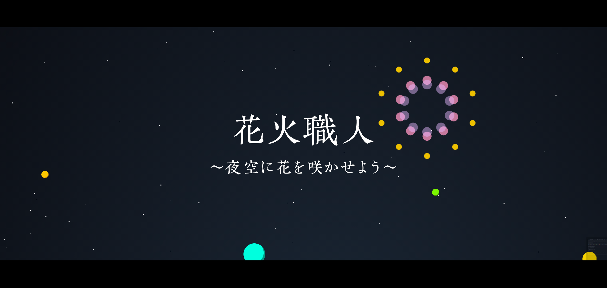
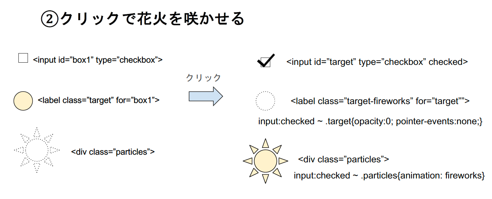
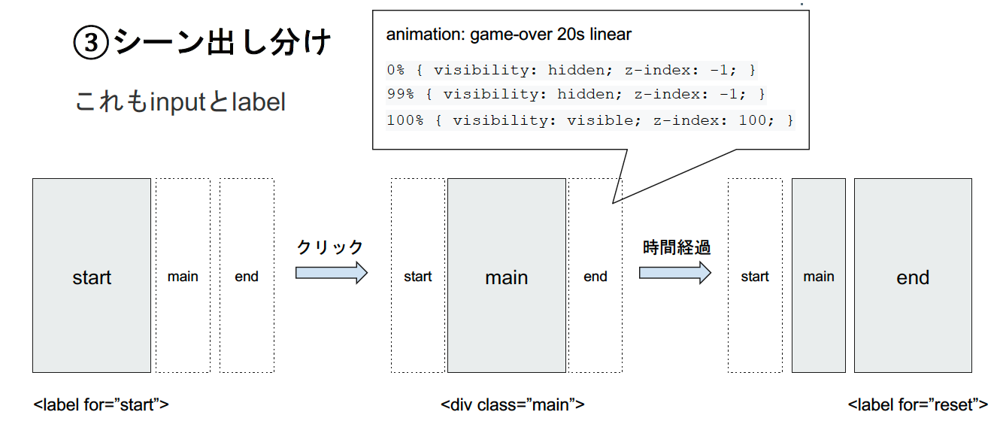

# HTMLとCSSだけでゲームを作ってみた

## ゲーム「花火職人」


[](https://imaokahiroaki.github.io/css_game/)

[ゲームをプレイする](https://imaokahiroaki.github.io/css_game/)

>【ルール説明】  
>夜空に放たれる花火の玉をクリックして花火を全て咲かせよう。  
>右上のバーが時間制限になっているぞ！

# ポイントのピックアップ
技術的な部分でポイントを以下にピックアップしています。

1. 花火アニメーション
2. クリックで花火を咲かせる挙動
3. シーン出し分け
4. 星空表現


## 1. 花火アニメーション
クリックした後の花火のアニメーションを表現するために使っているCSSテクニック
[花火のアニメーション](https://imaokahiroaki.github.io/css_game/fire.html)

-  **clip-path: circle(1px at 10px10px);**   
火花の円をclip-pathで作成しています。  
火花自体は長方形なのですが、clip-pathで円形にクリッピングし、CSSアニメーションで円の大きさと位置を操作しています。  

-  **filter: hue-rotate(360deg);** 
hue-rotateで要素およびその中身のコンテンツの色相環を回転します。  
花火の色彩は、CSSアニメーションで以下の設定をしています。

```
0%　hue-rotate(0deg)
↓
100%　hue-rotate(360deg)
```

これにより、動きと共に色を変更して、花火のような表現を行なっています。

-  **animation-delay**   
アニメーションの開始を遅らせる時間を指定します。  
火花の表現では、玉の挙動を３つ複製して、0.1秒ずつずらしたものを重ねています。  

## 2. クリックで花火を咲かせる挙動



クリックで花火を咲かせる挙動はinputタグとlabelタグで作成してます。  
inputタグは非表示にしておき、labelで花火の玉を作ります。  
花火アニメーションは最初非表示にしておき、花火の玉と常に並行移動するようにしておきます。  
花火の玉をクリックすると、チェックボックスにチェックが入り、花火の玉はそこで非表示にさせます。  
チェックボックスのチェックは入った時、花火アニメーションを表示させ、アニメーションを実行させます。  
これによって、花火の玉をクリックした際に、花火が咲いたような表現を行なっています。  

## 3. シーン出し分け



ゲームにおいて大切なのは、スタート画面・ゲームオーバー画面といったシーン分けです。  
これもinputタグとlabelタグで作成しています。  

シーンは以下の３つを作成しています。
- スタート
- メイン
- ゲームオーバー
 
スタートシーンはチェックボックスと紐づくlabelにしておき、スタート画面をクリックしたらメイン画面が表示されるようにし、20秒のゲームオーバーアニメーションを実行させます。  
ゲームオーバーアニメーションでは、最初は非表示のゲームオーバー画面が20秒後に表示されるように設定します。  
ゲームオーバー画面は```<input type="reset">```と紐づくlabelに設定します。  
```<input type="reset">```は、チェックボックスのチェックを全て外してくれるinputタグです。  
これを押せば、今までにクリックしてきた花火のチェックが全て外れ、一番最初の状態に戻ります。  

## 4. 星空表現
以下のコードを拝借しました。
### Parallax Pixel Stars Using Pure CSS
https://codepen.io/sarazond/pen/LYGbwj

- box-shadow 複数ランダム指定  
1pxの小さな正方形を用意し、その影を白色にします。  
for文でbox-shadowをランダムに200個追加すると、簡単に夜空に散らばる星が再現できます。  

# 参考元
以下記事を大いに参考にさせていただきました。  
[HTMLとCSSだけでミニゲームをつくる - めろたんのアレ](https://merotan.hatenablog.com/entry/2017/12/16/190415)
